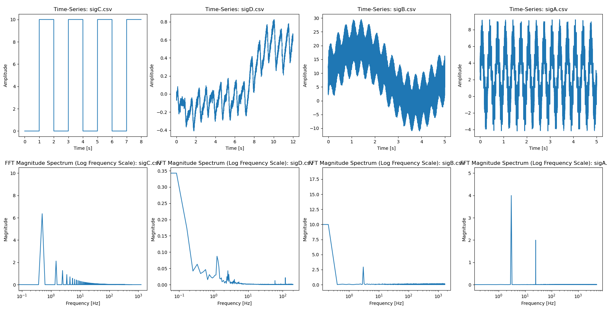

# HW10

see `hw10.py` for more details.

## 4. Generate a figure with a subplot of the signal vs time and a subplot of the FFT of each CSV

## 5. Upload an image of a plot of each CSV with the unfiltered data in black, the filtered in red, and the number of data points averaged in the title, as well as your code.

## 6. Upload an image of a plot of each CSV with the unfiltered data in black, the filtered in red, and the weights A and B in the title, as well as your code.

## 7. Upload an image of a plot of each CSV with the unfiltered data in black, the filtered in red, and some information about weights used in the title, like how many, what type of filter, the cutoff frequency and bandwidth, as well as your code.

