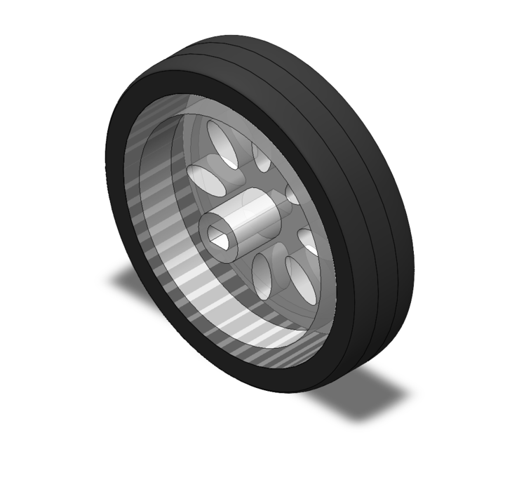
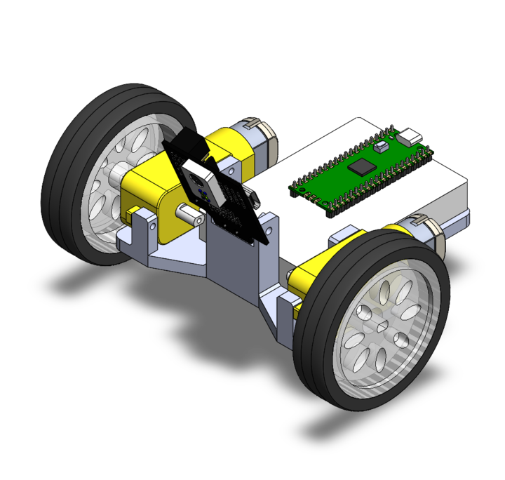

# HW14: Robot CAD

I'm using SolidWorks for CAD, so I'm not attaching source files here. See below for images.

# Images

**Wheel** - I have an existing wheel that I planned to use so instead of using o-rings I CADed an actual wheel.

**ROBOT** - small foot-print, 3D printed chassis, with a pixy cam mount.

