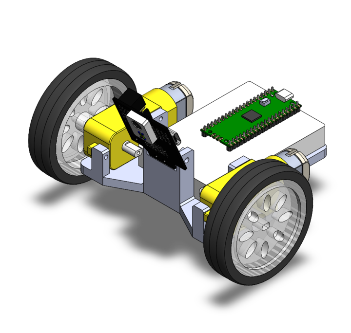

# HW17 & 18: Line follower bot

I'm writing this readme after finishing the entire project so I'll just use the real thing for demo. See code implementations in `main.cpp`

## DEMO:


## CAD image:



This is a minimal design with 3D printed chassis carrying a breadboard, tt motors, and a pixy cam.

## Circuit diagram:

```
                    LINE FOLLOWER CONTROL CIRCUIT
                         (MODE pin HIGH)

USB Power ----+
              |
         +----+----+
         |         |
         |    ┌─────────┐      I2C Bus
         |    │ PICO2   │    ┌─────────────┐
         |    │         │    │             │
         |    │ GP20────┼────┤SDA          │
         |    │ GP21────┼────┤SCL     ┌────┴────┐
         |    │         │    │        │ PIXY2   │
         |    │ GP16────┼──┐ │        │ CAMERA  │
         |    │ GP17────┼──┼─┤        └────┬────┘
         |    │ GP18────┼──┼─┤             │
         |    │ GP19────┼──┼─┤        5V───┤
         |    │         │  │ │        GND──┤
    5V───┤VBUS         │  │ └─────────────┘
   GND───┤GND          │  │
         │             │  │
         └─────────────┘  │
                          │
    Battery Pack          │    ┌─────────────┐
    (6V-9V)               │    │  DRV8835    │
       +                 │    │ H-BRIDGE    │
       │                 └────┤AIN1 (PH)    │
       │                      │AIN2 (EN)    │
       │              ┌───────┤BIN1 (PH)    │
       │              │   ┌───┤BIN2 (EN)    │
       │              │   │   │             │
       │              │   │   │MODE─────────┤─── +5V (HIGH)
       │              │   │   │             │
       ├──────────────┼───┼───┤VMOT         │
       │              │   │   │VCC──────────┤─── 3.3V
       │              │   │   │GND──────────┤─── GND
       │              │   │   │             │
       │              │   │   │AOUT1────────┤──┐
       │              │   │   │AOUT2────────┤──┼─── MOTOR A
       │              │   │   │BOUT1────────┤──┤    (LEFT)
       │              │   │   │BOUT2────────┤──┘
       │              │   │   └─────────────┘
       │              │   │
       └──────────────┴───┴─── COMMON GND
```

### Pin Assignments
| PICO2 | DRV8835   | Function         |
|-------|-----------|------------------|
| GP16  | AIN1 (PH) | Motor A Direction|
| GP17  | AIN2 (EN) | Motor A Speed    |
| GP18  | BIN1 (PH) | Motor B Direction|
| GP19  | BIN2 (EN) | Motor B Speed    |
| GP20  | ---       | Pixy2 SDA        |
| GP21  | ---       | Pixy2 SCL        |
| 3V3   | VCC       | Logic Power      |
| VBUS  | ---       | Pixy2 5V Power   |
| GND   | GND       | Common Ground    |

### Control Logic (MODE=HIGH, PH/EN Mode)
| Direction | PH Pin  | EN Pin | Motor Action |
|-----------|---------|---------|--------------|
| Forward   | LOW(0)  | PWM     | CW Rotation  |
| Reverse   | HIGH(1) | PWM     | CCW Rotation |
| Stop      | X       | 0       | No Motion    |
